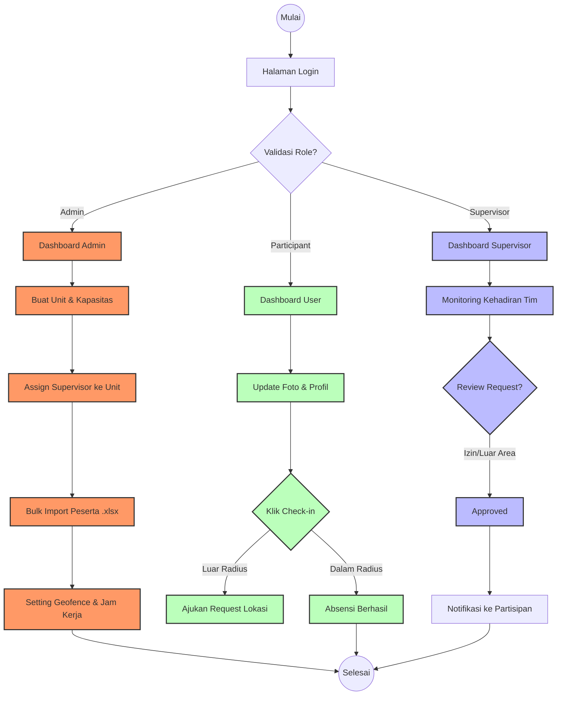

# 🌊 Final Flowchart Logic - Project Puti (Base on Code)

Dokumen ini adalah referensi final untuk alur kerja sistem **PuTI**, yang disusun berdasarkan logika kode aktual (API, Role, dan Database).

---

### 🎨 Teks Kode Mermaid.js (Final)
Gunakan kode di bawah ini pada [Mermaid Live Editor](https://mermaid.live/) untuk menghasilkan diagram alir.

---

### 📖 Penjelasan Logika (Base on Code)

1.  **Otentikasi & Authorization**:
    *   Sistem memvalidasi kredensial (Telkom SSO/Manual) dan membaca `UserRole` dari database untuk menentukan rute dashboard yang dituju.
2.  **Manajemen Data (Admin)**:
    *   Logika pembuatan unit (`Unit` model) wajib dilakukan sebelum *assignment*. 
    *   Penggunaan *Bulk Import* memvalidasi data excel agar sesuai dengan skema tabel `users`.
3.  **Presensi & Geofencing (Participant)**:
    *   `Check-in` melibatkan deteksi koordinat GPS yang dibandingkan dengan `MapSettings` (API validation).
    *   Jika koordinat di luar radius, sistem memicu pembuatan record pada tabel `monitoring_locations` (Request Loc).
4.  **Monitoring & Evaluasi (Supervisor)**:
    *   Supervisor mengakses record dari `monitoring_locations` dan `leave_requests` untuk melakukan aksi `updateStatus` (Approved/Rejected).
    *   Data penilaian disimpan dalam model `Assessment`.

---
**Status Dokumen:** Final & Verified Based on Source Code.
