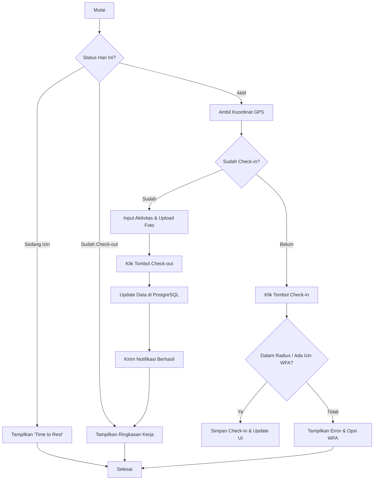
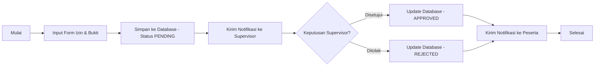

# Flowchart System (Project Puti)

Dokumen ini berisi logika alur sistem yang dapat digunakan pada **[CodeToFlow](https://codetoflow.com/)** (menggunakan format pseudo-code/JS) atau divisualisasikan langsung di Markdown menggunakan **Mermaid**.

## 1. Alur Presensi Harian (Check-in & Check-out)
Salin kode di bawah ini ke **CodeToFlow.com** untuk melihat flow yang interaktif.

```javascript
// Logic for codetoflow.com
function dailyAttendanceFlow() {
  start();
  openDashboard();
  
  if (isUserOnLeave()) {
    showStatus("Time to Rest");
    hideMap();
    return;
  }

  fetchGPSLocation();

  if (isAlreadyCheckedOut()) {
    showSummary("All Done");
    stop();
  } else if (!isAlreadyCheckedIn()) {
    if (userClicksCheckIn()) {
      calculateDistanceToUnit();
      
      if (isInRadius() || hasWFAApproval()) {
        saveCheckInToDatabase();
        updateUI("Checked-in State");
      } else {
        showAlert("Out of Area");
        offerWFARequest();
      }
    }
  } else {
    // Stage: Checked-in, Waiting for Check-out
    inputDailyActivity();
    uploadEvidencePhoto();
    
    if (userClicksCheckOut()) {
      updateAttendanceRecord();
      sendSuccessNotification();
      showWorkSummary();
    }
  }
  
  stop();
}
```

## 2. Mermaid Flowchart (Direct Markdown Support)
Diagram ini dapat langsung dirender oleh GitHub, VS Code (dengan plugin Mermaid), atau [Mermaid Live Editor](https://mermaid.live/).

### A. Alur Absensi & Geofencing


### B. Alur Pengajuan Izin


## Referensi Converter & Tools
Jika Anda ingin menerjemahkan flowchart ke format lain, berikut referensi terbaik:

1.  **[Mermaid Live Editor](https://mermaid.live/)**: Standar industri untuk mengubah teks (Mermaid Syntax) menjadi diagram (SVG/PNG). Sangat direkomendasikan karena integrasi Markdown-nya sangat luas.
2.  **[CodeToFlow](https://codetoflow.com/)**: Sangat bagus jika Anda memiliki logika pemrograman (JavaScript/Java) dan ingin melihat alur logikanya secara otomatis.
3.  **[Draw.io (Integration)](https://app.diagrams.net/)**: Anda bisa mengimpor kode Mermaid/PlantUML ke dalam Draw.io untuk editing manual yang lebih fleksibel.
4.  **[PlantUML Online Server](https://www.plantuml.com/plantuml/)**: Fokus pada diagram teknis yang sangat detail (seperti yang ada di file PPL sebelumnya).
